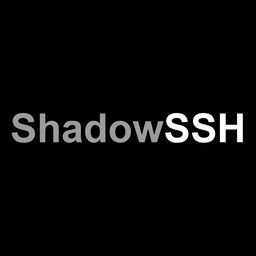
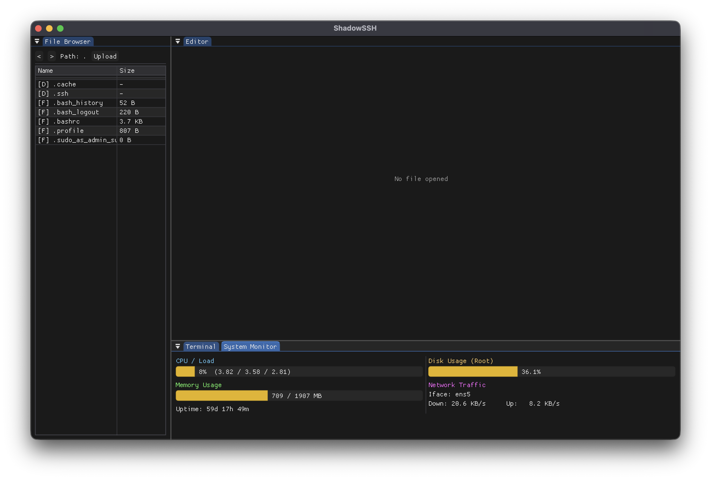

<div align="center">



# ShadowSSH

**A fast, lightweight, private SSH client for developers — cross-platform, plug-and-play.**

[](LICENSE)
[](https://github.com/beltromatti/ShadowSSH/releases)
[](#downloads)
[](https://github.com/beltromatti/ShadowSSH/actions)



</div>

---

## Why ShadowSSH

Every other GUI SSH client is bloated, slow, or ships your sessions through someone else's cloud. **ShadowSSH is the opposite.** A single native binary, no telemetry, no account, no internet round-trip. Open it, connect, work — that's it.

Built on **SDL2 + Dear ImGui + libssh + libvterm**, it boots instantly, draws a real terminal locally, and stays out of your way.

## Highlights

- **Native everywhere** — macOS (Apple Silicon & Intel), Linux (x64 & ARM64), Windows (x64). Same UI, same shortcuts, same speed.
- **In-app VT terminal** — libvterm emulation with colors, scrollback, selection, copy/paste, control codes (^C/^Z/^D).
- **SFTP file browser & editor** — browse, open, edit with syntax highlighting, save-uploads in one keystroke.
- **Live system monitor** — CPU, load, memory, disk, network on a dedicated SSH channel.
- **Zero config** — auto-loads `~/.ssh/config`, remembers recent hosts, pulls credentials from the OS keystore (Keychain / DPAPI / secured file).
- **Strict host-key checking** — known hosts only. No "type yes to ignore" prompts.
- **One-click native terminal launch** — drops you into Terminal.app / Windows Terminal / your `$TERMINAL` of choice.

## Downloads

Grab the release for your platform from the [Releases page](https://github.com/beltromatti/ShadowSSH/releases/latest):

| Platform              | Artifact                                  |
| --------------------- | ----------------------------------------- |
| macOS (Apple Silicon) | `ShadowSSH-<v>-macos-arm64.tar.gz`        |
| macOS (Intel)         | `ShadowSSH-<v>-macos-x64.tar.gz`          |
| Linux x86_64          | `ShadowSSH-<v>-linux-x64.tar.gz`          |
| Linux ARM64           | `ShadowSSH-<v>-linux-arm64.tar.gz`        |
| Windows x86_64        | `ShadowSSH-<v>-windows-x64.zip`           |

## Build from source

Install the runtime libraries — `libssh`, `SDL2`, `freetype` — then:

```bash
git clone https://github.com/beltromatti/ShadowSSH.git
cd ShadowSSH
./scripts/build.sh --version 1.1.0 --target macos-arm64
```

`scripts/build.sh` is the single entry point for every target. Omit `--target` to build all available targets sequentially. Omit `--version` for `0.0.0`. The chosen version is baked into the binary, `.app` bundle, and archive name.

## Shortcuts

| Action                     | macOS         | Linux / Windows |
| -------------------------- | ------------- | --------------- |
| Save active editor tab     | ⌘ S           | Ctrl + S        |
| Copy terminal selection    | Ctrl + C      | Ctrl + C        |
| Paste into terminal        | Ctrl + V      | Ctrl + V        |
| Send Ctrl+C / Ctrl+Z / etc | Terminal menu | Terminal menu   |

## Privacy

ShadowSSH never phones home. There is no account, no analytics, no auto-update beacon. Credentials live in the OS-native secure store. Connection history stays in your config directory. Your keys never leave your machine.

## Tech stack

C++17 · SDL2 · Dear ImGui (docking) · libssh · libvterm · ImGuiColorTextEdit · CMake.

## About

ShadowSSH is the personal project of **Mattia Beltrami**, Computer Engineering student at **Politecnico di Milano**. Built because the tools available weren't fast or honest enough.

## License

[Apache License 2.0](LICENSE) — free for personal and commercial use.

---

<div align="center">

`#ssh` · `#sftp` · `#terminal` · `#cpp` · `#imgui` · `#sdl2` · `#cross-platform` · `#devtools`

</div>
